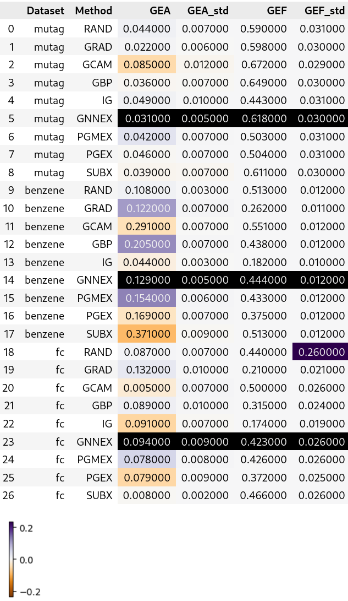

# Fork of GraphXAI 

```sh
# updated requirements.txt
# installing dependencies (python 3.13.5)
uv init
uv venv 
source .venv/bin/activate
uv pip install -e .
uv pip install torch # torch-cluster depends on torch
uv pip install -r requirements.txt --no-build-isolation
```

## Difference between Table 5 / GitHub data
> The uploaded GEA data is different from the published table. (The GEF data is the same). The highlighted colors show the difference; black means this data was not found on GitHub.
> 

## Unable to reproduce
> 

---


[Publication in Scientific Data](https://www.nature.com/articles/s41597-023-01974-x)

# GraphXAI

As explanations are increasingly used to understand the behavior of graph neural networks (GNNs), evaluating the quality and reliability of GNN explanations is crucial. However, assessing the quality of GNN explanations is challenging as existing graph datasets have no or unreliable ground-truth explanations. 

GraphXAI is a library for evaluating GNN explainers. It provides XAI-ready datasets, state-of-the-art explainers, data processing functions, visualizers, GNN model implementations, and evaluation metrics to benchmark GNN explainability methods.

One of the major features of this package is a novel ShapeGGen dataset generator, which can generate a variety of benchmark datasets (e.g., varying graph sizes, degree distributions, homophilic vs. heterophilic graphs) accompanied by ground-truth explanations. ShapeGGen is flexible and is parameterized such that generated graphs can have varying sizes, degree distributions, types of ground-truth explanations, levels of homophily/heterophily, and degrees of fairness as defined by a protected feature, all to capture various real-world scenarios. 

## Installation

After cloning the repo, install the graphxai package from the root directory of this project:

  ```pip install -e .```
  
This will allow you to access features within the package, including datasets, explainers, and evaluation tools.

## Data Availability

Downloads are provided for the datasets in our package through our page on the [Harvard Dataverse](https://doi.org/10.7910/DVN/KULOS8). 

## Citation

Please use the following BibTeX to cite this project in your work:
```
@article{agarwal2023evaluating,
  title={Evaluating Explainability for Graph Neural Networks},
  author={Agarwal, Chirag and Queen, Owen and Lakkaraju, Himabindu and Zitnik, Marinka},
  journal={Scientific Data},
  volume={10},
  number={144},
  url={https://www.nature.com/articles/s41597-023-01974-x},
  year={2023},
  publisher={Nature Publishing Group}
}
```
